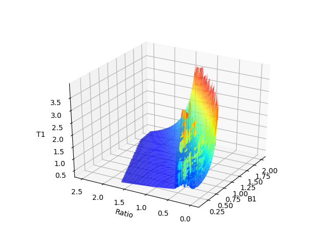
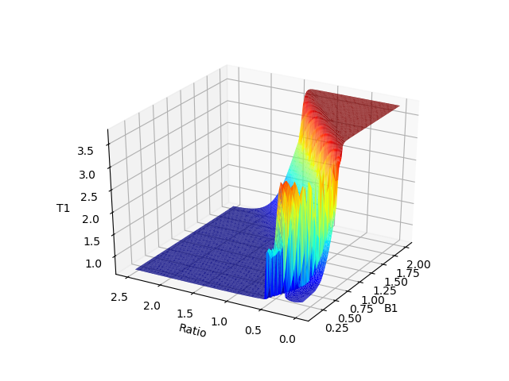

## Interpolation using scipy, sklearn and spark ml

First we will plot the data:

```
import pandas as pd
import matplotlib.pyplot as plt
from mpl_toolkits.mplot3d import Axes3D
import seaborn as sns

T1_Lookup = pd.read_csv("T1_Lookup.csv", usecols=["B1err","ratio","T1"])

#Plot orignal data as surface:
fig = plt.figure()
ax = fig.gca(projection='3d')
ax.plot_trisurf(T1_Lookup["B1err"],T1_Lookup["ratio"],T1_Lookup["T1"], cmap=plt.cm.jet, linewidth=0.2, antialiased=True)
ax.set_xlabel('B1')
ax.set_ylabel('Ratio')
ax.set_zlabel('T1')
ax.view_init(azim=210)
plt.show()
```


This is scattered data plotted using matplotlib's trisurf.

Based on MPRAGE_FLASH_LUT, which evaluates a set of functions at certain values of B1 and T1 and gives a Ratio value. The end goal is create a "reverse lookup table" to be able to find value of T1 for any given value of B1 and Ratio. Thus we will try to fit a function to our sample data, and interpolate. [Comprehensive stack overflow post on interpolation in scipy](https://stackoverflow.com/questions/37872171/how-can-i-perform-two-dimensional-interpolation-using-scipy)

### Using scipy's griddata
```
#Regular 100x100 grid to interpolate onto
x1=np.linspace(0.1,2,100)
x2=np.linspace(0.0005,2.5,100)
x1_2 = np.zeros([100,100])
x2_2 = np.zeros([100,100])
for i in range(0,len(x1)):
    for j in range(0,len(x2)):
        x1_2[i, j] = x1[i]
        x2_2[i, j] = x2[j]

x1 = x1_2.flatten()
x2 = x2_2.flatten()

#Interpolate using griddata:
x3 = interpolate.griddata(np.array([T1_Lookup["B1err"],T1_Lookup["ratio"]]).T,
                          T1_Lookup["T1"],(x1,x2))
```
Plot the interpolated data:
```
fig = plt.figure()
ax = fig.gca(projection='3d')
ax.plot_trisurf(x1,x2,x3, cmap=plt.cm.jet,vmin=0, vmax=4, linewidth=0.2, antialiased=True)
ax.set_xlabel('B1')
ax.set_ylabel('Ratio')
ax.set_zlabel('T1')
ax.view_init(azim=210)
plt.show()
```



### Tensorflow

We can also use neural nets to approximate functions. This is the closet I could get so far using a 2 layer neural net with 25 hidden nodes in each layer and L2 regularization:



### Spark
