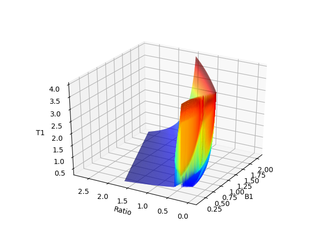

## Piecewise interpolation using linear models in sklearn and spark ml

First we will plot the data:

```
import pandas as pd
import matplotlib.pyplot as plt
from mpl_toolkits.mplot3d import Axes3D
import seaborn as sns

T1_Lookup = pd.read_csv("T1_Lookup.csv", usecols=["B1err","ratio","T1"])

#Plot orignal data as surface:
fig = plt.figure()
ax = fig.gca(projection='3d')
ax.plot_trisurf(T1_Lookup["B1err"],T1_Lookup["ratio"],T1_Lookup["T1"], cmap=plt.cm.jet, linewidth=0.2, antialiased=True)
ax.set_xlabel('B1')
ax.set_ylabel('Ratio')
ax.set_zlabel('T1')
ax.view_init(azim=210)
plt.show()
```



The sample data is generated using this MATLAB code:

It evaluates a set of functions at certain values of B1 and T1 and gives a Ratio value. The end goal is create a "reverse lookup table" to be able to find value of T1 for any given value of B1 and Ratio. Thus we will try to fit a function to our sample data, and interpolate.

### Using sci-kit learn
First we will try a simple cubic fit, then do piecewise linear and quadratic models:

```
from sklearn import linear_model
#Set up linear model equations:
x1=T1_Lookup["B1err"]
x2=T1_Lookup["ratio"]
# y = x1 + x1^2 + x1^3 + x2 + x2^2 + x2^3
model_eq = [x1,np.power(x1,2),np.power(x1,3),x2,np.power(x2,2),np.power(x2,3)]
#Conver to pandas
model_df = pd.DataFrame(model_eq)
model_df = model_df.T
#Fit linear model using sklearn
lm = linear_model.LinearRegression()
lm.fit(model_df,T1_Lookup["T1"])
```
We can plot our fitted function to see how well it did. We can do this by evaluating our model at several values of B1err and ratio (x1 and x2)

```
#Data to interpolate - a regular 100X100 grid of B1 and Ratio values
x1=np.linspace(0.1,2,100) #B1
x2=np.linspace(0.0005,2.5,100) #Ratio
x1_2 = np.zeros([100,100])
x2_2 = np.zeros([100,100])
for i in range(0,len(x1)):
    for j in range(0,len(x2)):
        x1_2[i, j] = x1[i]
        x2_2[i, j] = x2[j]

x1 = x1_2.flatten()
x2 = x2_2.flatten()
#Data to interpolate also has to follow our linear model equations, meaning we have to supply all x values in the equation:
predict_eq=[x1,np.power(x1,2),np.power(x1,3),x2,np.power(x2,2),np.power(x2,3)]
predict_df = pd.DataFrame(predict_eq)
predict_df = predict_df.T
x3=lm.predict(predict_df)

#Plot using trisurf code above
```


Fit is pretty bad. Now we will try a piecewise linear model with 10 knots (10 knots for B1 and 10 knots for Ratio).

The equation for a piecewise function is:

y = a0 + a1x + sum(a(x-xknot)xdummy)


### Spark
